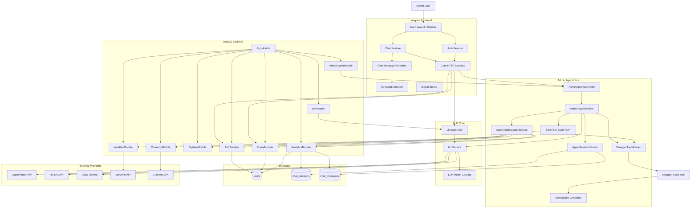
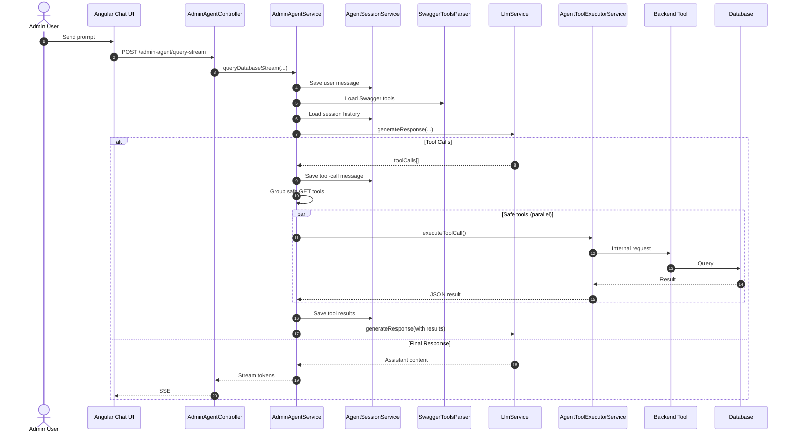
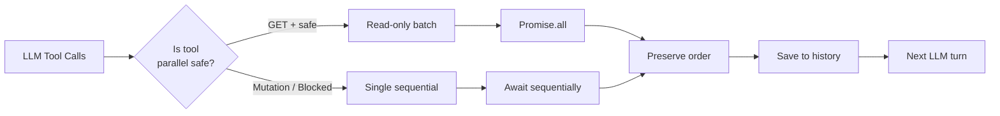
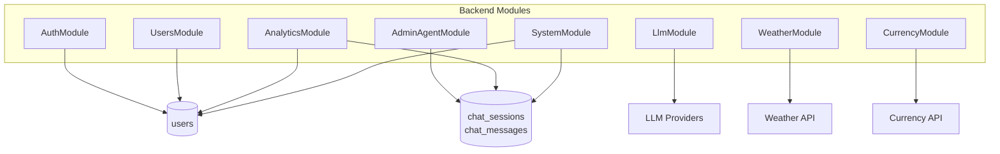
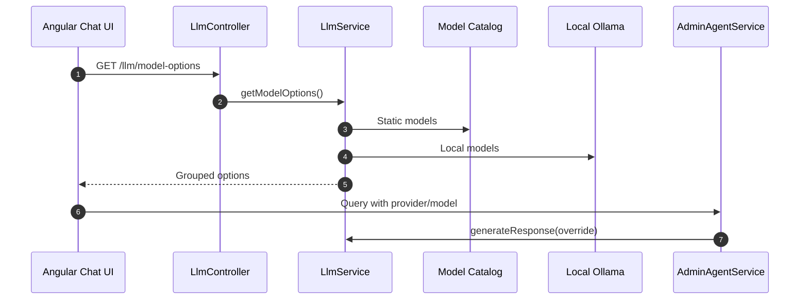

# Agentic Admin Architecture Diagram

This document describes the current high-level architecture of the Agentic Admin system.

The system is a full-stack admin application:

- Angular frontend for chat, authentication, layout, and admin screens.
- NestJS backend for REST APIs, authentication, database access, agent orchestration, and LLM access.
- Swagger-generated tool metadata that turns backend endpoints into callable admin-agent tools.
- External providers for LLMs, weather, currency, and local Ollama models.

## System Architecture



## Chat And Tool Execution Flow



## Tool Safety And Parallel Execution



## Backend Module Responsibilities



## GenUI Rendering Path

````mermaid
flowchart TD
  ToolEndpoint[Backend Endpoint\nwith genUiSpec] --> SwaggerSpec[swagger-spec.json]
  SwaggerSpec --> Parser[SwaggerToolsParser]
  Parser --> ToolDesc[Tool Description\n+ GenUI Instruction]
  ToolDesc --> LLM[LlmService]
  LLM --> Component[```component]
  Component --> Stream[SSE Stream]
  Stream --> AiFormat[AiFormat Directive]
  AiFormat --> Skeleton[Skeleton Loader]
  AiFormat --> Render[Sanitized GenUI Component]
````

## Model Selection Path



## Current Architecture Notes

- The backend is the **source of truth** for available LLM models.
- Swagger metadata is the tool catalog for the admin agent.
- `genUiSpec` is defined in shared constants and attached via Swagger decorators.
- The agent currently runs in a **single active flow** (no independent sub-agents yet).
- Read-only tools run in parallel, mutations run sequentially.
- Full conversation history (user + assistant + tool messages) is persisted in the backend.
